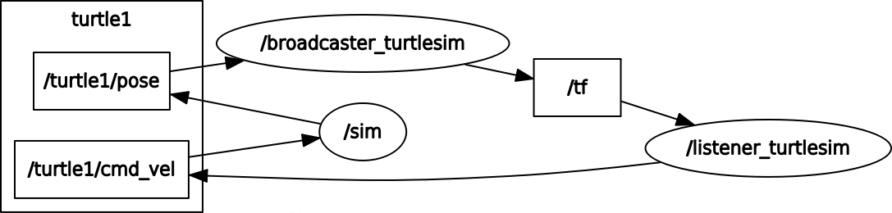

.. _state_machine_index:

###################
State Machine
###################

The *state_machine* package contains an example of a basic State Machine into
the ROS environment using turtlesim as demo.

In the simulation it is shown a simple closed loop structure using the power of 
ROS tf. 

A test node is also included as a way of demonstrating possible delays or losses
between "/world" and "/tartaruga" frames.

